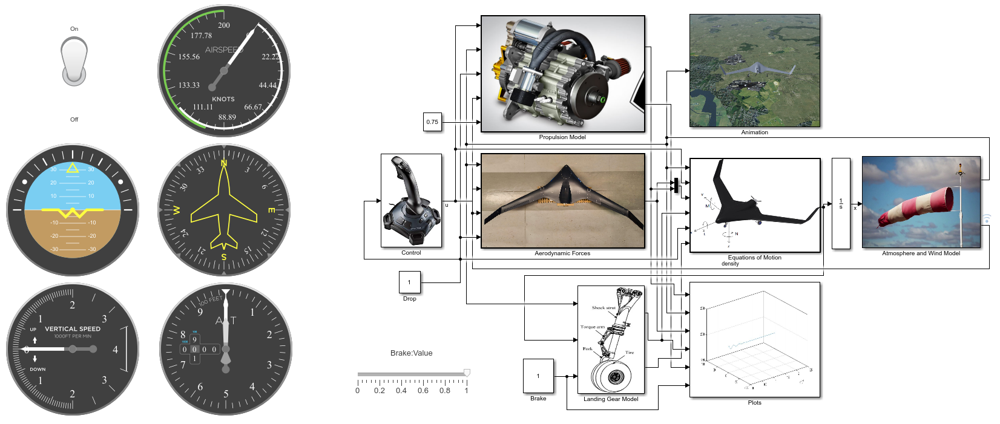
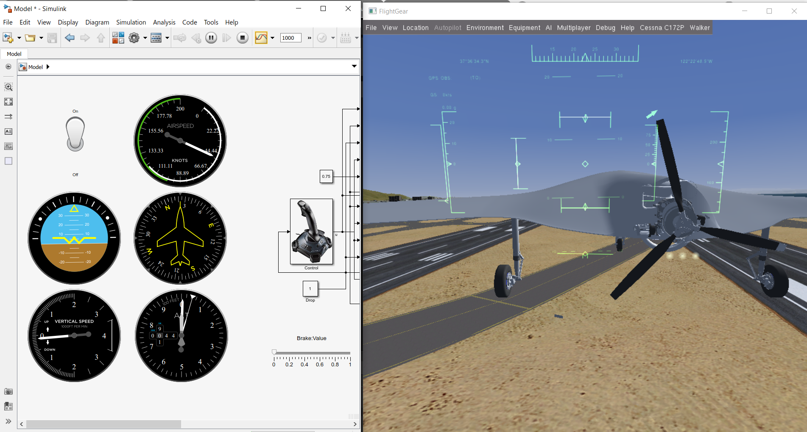

# Flight_Simulator
A dynamic flight simulation model for a Blended Wing Body (BWB) Unmanned Aerial Vehicle (UAV), including take-off, cruise, payload drop and landing, using Matlab and Simulink software. The model’s purpose is to get a better understanding on the aircraft’s behavior during the different phases of its mission. The simulator operates by solving the airplane’s equations of motion. The aerodynamic forces and moments acting on the aircraft are determined using polynomial modeling, where each force and moment coefficient is expressed as a polynomial function, extracted from CFD simulations. The simulator also calculates forces and moments produced by the engine and the landing gear. Moreover, the model is able to take into account the effect of wind, in case of hazardous weather conditions. In each loop, the simulator takes throttle and control surfaces’ deflections as inputs, calculates the aircraft's state, and finally outputs the results to Flightgear, an open source flight simulator software, for real-time visualization of the aircraft’s mission.

## Requirements
Matlab version R2018a is required. The Aerospace Blockset Simulink library is needed, which includes many of the built-in blocks used in the model, such as the Flight Instruments blocks. FlightGear version v2017.3 is also required in order to watch the flight in real-time.

## Usage
1. Open matlab and run Model.slx in order to open the Simulink model.
2. Run runfg_send_and_receive.bat included in /src, which contains the information needed for the connection between the model and FlightGear and starts a FligthGear version connected with the Simulink model.
3. You can change the aircraft's starting state by changing the initial conditions vector of the Integrator block. State vector: [u, v, w, p, q, r, φ, θ, ψ, x, y, z]
4. Start the simulation using the Simulink start button and watch the flight in FlightGear. Two windows next to eachother are recommended in order to be able to watch both Simulink and FlightGear at the same time, as shown in the picture below.
5. Use a joystick to fly the aircraft. A joystick is essential in order for the model to work at its current version.
6. Use the Drop On/Off Switch in the Simulink model to "drop the carriage" and change the aircraft characteristics, such as the position of its center of gravity.
7. In case of landing use the Brake Slider in order to apply brakes.
8. At the end or during the simulation you can see the aircraft state variables values in graphs inside the Plots block.

## License
This project is licensed under the terms of the MIT license.